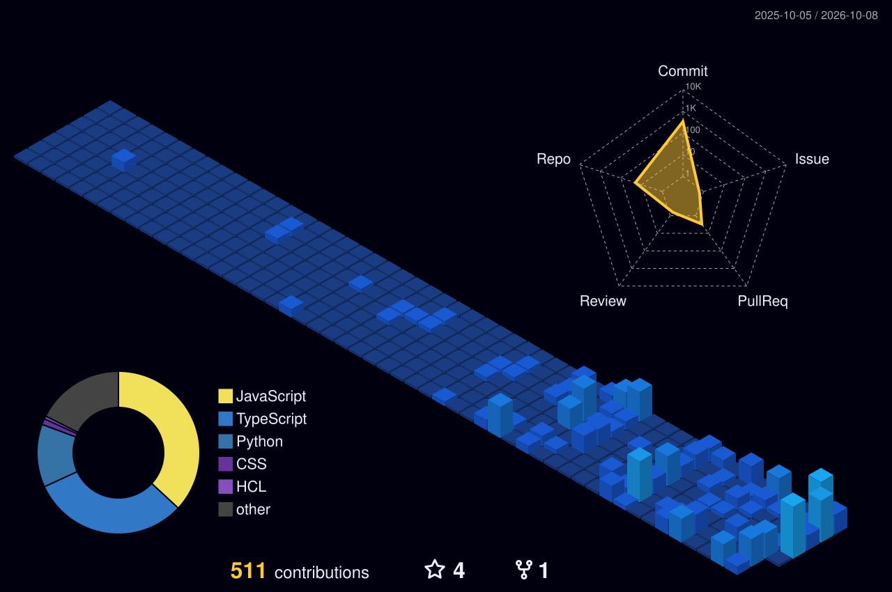

 

---

### ⚡ Backend Engineer • Full-Stack Developer • Problem Solver

**I build APIs, real-time applications, distributed systems, and AI-powered products.**

*Focused on clean architecture, scalable systems, and shipping things that actually work.*

---

## 🧠 What I Do

<table>
<tr>
<td width="50%" valign="top">

### 🔐 Backend Engineering
- REST APIs & API architecture
- Authentication & authorization
- JWT, RBAC & API security
- PostgreSQL, MongoDB & Redis

</td>
<td width="50%" valign="top">

### ⚡ Distributed & Real-Time
- Distributed rate limiting
- Redis-based systems
- WebSockets & Socket.io
- Scalable backend architecture

</td>
</tr>
<tr>
<td width="50%" valign="top">

### 🎨 Full-Stack Development
- React & Next.js
- TypeScript
- Tailwind CSS
- End-to-end product development

</td>
<td width="50%" valign="top">

### 🤖 AI-Powered Products
- AI integrations
- Computer vision
- Intelligent web platforms
- Automation & smart workflows

</td>
</tr>
</table>

---

## 🛠️ Tech Stack

---

## 🚀 Featured Projects

<table>
<tr>
<td width="50%" valign="top">

### 🔥 Distributed Rate Limiter

A distributed backend system that protects APIs from excessive traffic while maintaining request limits across multiple application instances.

**Redis · Node.js · Distributed Systems · API Security**

</td>
<td width="50%" valign="top">

### 🏛️ YojanaSaarthi

AI-powered government scheme discovery platform designed to help users discover relevant schemes through search, filtering and personalized access.

**Next.js · TypeScript · MongoDB · NextAuth**

</td>
</tr>
<tr>
<td width="50%" valign="top">

### 🛒 ShopNow

Full-stack MERN e-commerce platform with authentication, role-based access, product management, search, filtering, cart and admin functionality.

**MongoDB · Express · React · Node.js · JWT**

</td>
<td width="50%" valign="top">

### 💬 Connectify

Real-time chat application with instant messaging, online/offline presence and persistent conversations powered by WebSockets.

**React · Node.js · Express · MongoDB · Socket.io**

</td>
</tr>
</table>

---

## 🌐 GitHub in 3D

 

My contribution history visualized as a 3D landscape — generated automatically from GitHub activity.

---

## 📊 GitHub in Motion

 

---

## 📈 Contribution Activity

<!-- BEGIN ACTIVITY-GRAPH -->
<picture>
  <source media="(max-width: 767px)" srcset="activity-graph-mobile.svg">
  
</picture>
<!-- END ACTIVITY-GRAPH -->

---

## 🐍 Commit by Commit

<picture>
<source media="(prefers-color-scheme: dark)" srcset="https://raw.githubusercontent.com/Ayushsoni9125/Ayushsoni9125/output/github-snake-dark.svg">
<source media="(prefers-color-scheme: light)" srcset="https://raw.githubusercontent.com/Ayushsoni9125/Ayushsoni9125/output/github-snake.svg">

</picture>

---

### 💬 Let's Build Something Great

  

  

<i>Building backend systems. Shipping full-stack products. Learning every day.</i>

